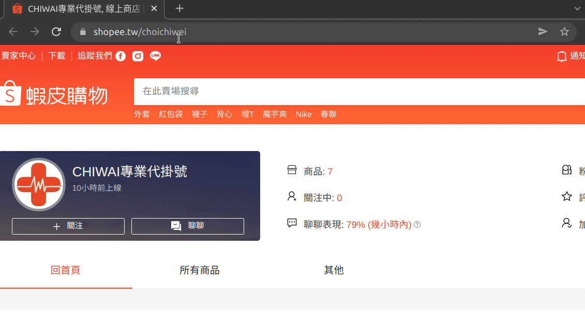

# Shopee Store Revenue Report
Shopee store revenue report can show the store sales. For example, monthly revenue. According to the web address and a specific time interval, we can use its reviews to estimate total revenue during this time.
 
# Example

 
# Start
### Initialization
Install modules that package depends on.
```
$ npm install
```
### Building
Build executable file from source code.
```
user@user:~/repo/shopee-store-revenue-report$ npm run build
 
> shopee-store-revenue-report@1.0.0 build /home/user/repo/shopee-store-revenue-report
> pkg ./package.json
 
> pkg@5.5.2
 
user@user:~/repo/shopee-store-revenue-report$
```
### Usage
Start the executable file.
```
user@user:~/repo/shopee-store-revenue-report$ cd dist/
user@user:~/repo/shopee-store-revenue-report/dist$ ./shopee-store-revenue-report --url https://shopee.tw/choichiwei --start 20220101 --end 20220110
██████████████████████████████████░░░░░░ 85% | ETA: 14s | 85.71428571428571/100
The revenue is NT$5050
Take: 1:32.211 (m:ss.mmm)
user@user:~/repo/shopee-store-revenue-report/dist$
```
 
# Reference
- [CHIWAI專業代掛號](https://shopee.tw/choichiwei)
- [台醫網路代掛號](https://shopee.tw/neverses)
- [Docker](https://www.docker.com/)